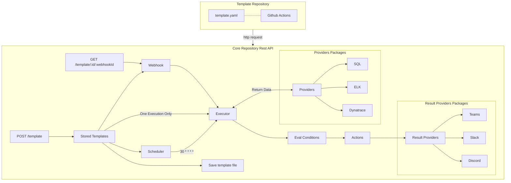

```mermaid
flowchart TB;
    subgraph s1[Template Repository]
        file[template.yaml]-.-CI[Github Actions]
    end

    s1--http request-->s2

    subgraph s2[Core Repository Rest API]
        EndpointById[GET /template/:id/:webhookId]
        EndpointById-->Webhook

        EndpointTemplate[POST /template]
        EndpointTemplate-->Templates[Stored Templates]

        Templates-->Webhook-->Executor
        Templates--One Execution Only-->Executor
        Templates-->Scheduler--30 * * * *-->Executor
        Templates--->io[Save template file]
        Executor<--Return Data-->Providers

        subgraph s3[Providers Packages]
            Providers-->SQL
            Providers-->ELK
            Providers-->Dynatrace
        end
        Executor-->Conditions[Eval Conditions]
        Conditions-->Actions-->ResultProviders[Result Providers]

        subgraph s4[Result Providers Packages]
            ResultProviders-->Teams
            ResultProviders-->Slack
            ResultProviders-->Discord
        end
    end
```
